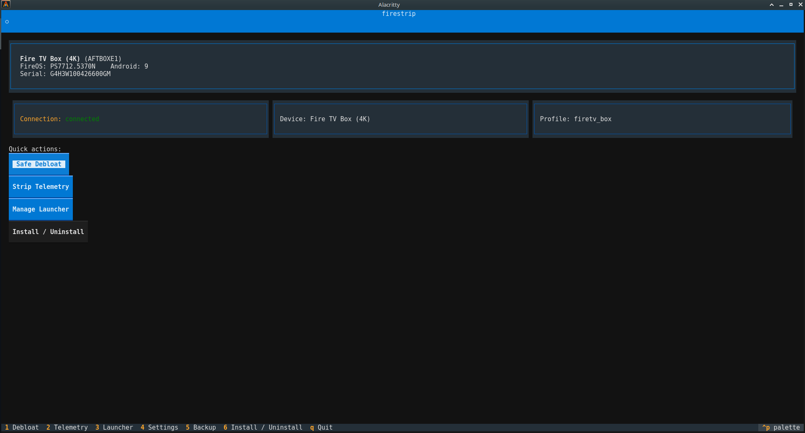
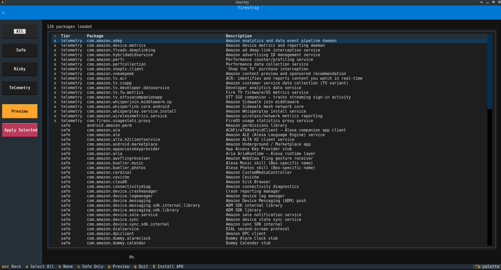
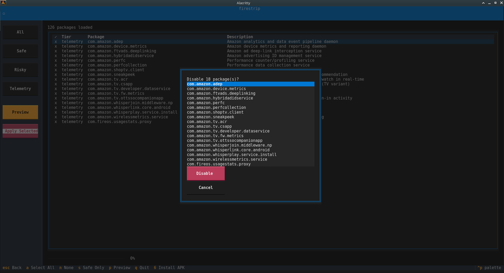
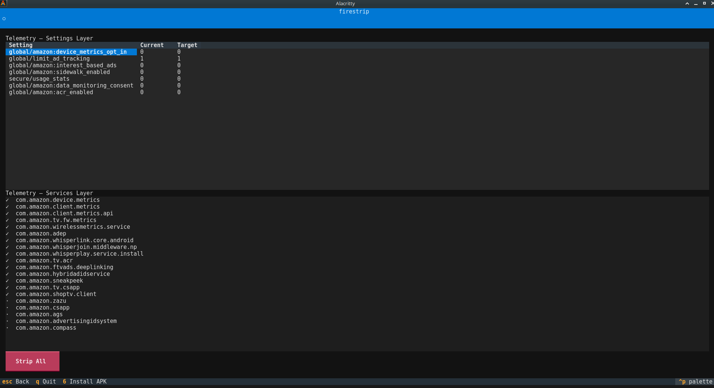
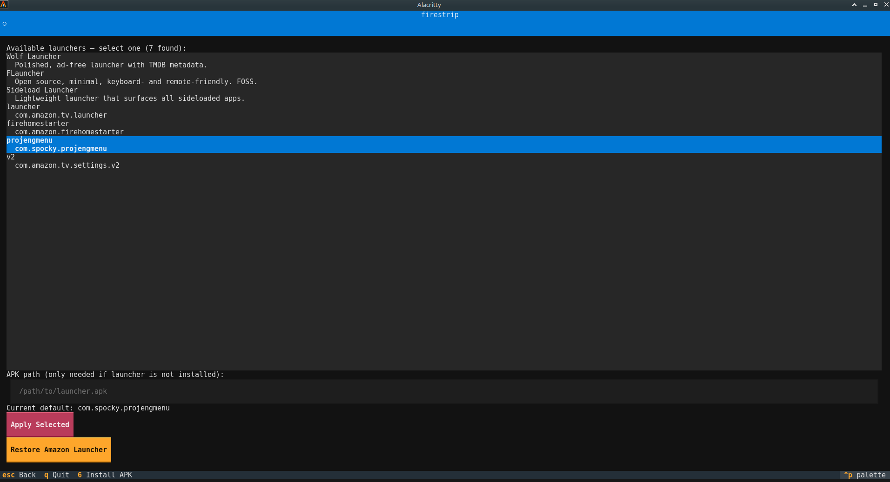
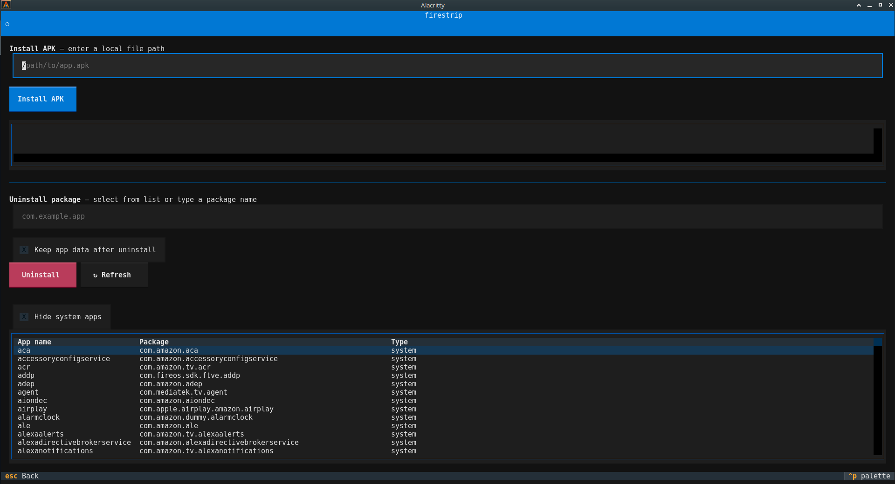

# firestrip

<p align="center">
  
</p>

**Reclaim your Amazon Fire TV from your Linux terminal.**

firestrip is a Linux-native TUI and CLI tool that removes Amazon's bloatware, silences telemetry, swaps the launcher, and tunes device settings — entirely over ADB, no root required, no Windows in sight.

<p align="center">
  <a href="https://buymeacoffee.com/succinctrecords"></a>
</p>

---

## Support This Project

firestrip is built and maintained by **one person**, in free time, with no corporate backing, no funding, and no team. Every device profile, every package classification, every line of the TUI was researched and written from scratch.

If firestrip:
- saved you from booting Windows just to debloat a stick
- stopped Amazon from silently fingerprinting your viewing habits
- gave you a Fire TV that actually works for *you*

— then consider buying a coffee. It takes 30 seconds and means a lot.

<p align="center">
  <a href="https://buymeacoffee.com/succinctrecords">
    
  </a>
</p>

Donations directly fund what keeps this project alive: tracking FireOS updates, adding new device profiles, and staying ahead of Amazon's ongoing attempts to lock down ADB access. The tool is free and always will be — but if it's worth a cup of coffee to you, [you know where the button is](https://buymeacoffee.com/succinctrecords).

---

## The Problem

Amazon Fire TV hardware is genuinely good. The software is not. Out of the box:

- The launcher is plastered with ads and "recommendations" you never asked for
- Dozens of background services collect usage data, fingerprint your viewing habits via ACR, and feed an advertising ID you can't easily opt out of
- Amazon Sidewalk runs silently, sharing your device's network with strangers
- Pre-installed apps you can't remove bloat storage and RAM
- The UI is optimised for Amazon's revenue, not your experience

Every existing tool to fix this is either Windows-only, macOS-only, an unmaintained shell script, or doesn't cover Fire TV at all. firestrip was built to be the tool that should have existed years ago.

---

## Screenshots

### Home screen — device connected



_The home screen after connecting to a device. Shows live device info: model name, FireOS build, Android version, and connection status._

---

### Debloat screen — packages loaded



_Package list with tier filter active. Packages are colour-coded by tier (Safe / Risky / Telemetry). Select individually or press `a` to select all visible._

---

### Confirm modal — before applying changes



_Every destructive action goes through a confirmation modal. The full list of changes is shown before anything executes._

---

### Telemetry screen — current vs target values



_Telemetry settings shown with their current live values and the target firestrip will write. Services list shows installed (✓) vs already removed (·)._

---

### Launcher screen — available launchers



_All HOME-intent handlers found on the device are listed. Pre-defined launchers are shown with FOSS tags where applicable; device-detected extras appear automatically._

---

### Install / Uninstall screen — package table



_Full package browser with sortable columns. Click any column header to sort. Toggle "Hide system apps" to focus on user-installed packages. Select a row to populate the uninstall field._

---


## Features

| Feature | Detail |
|---|---|
| **Interactive TUI** | 7-screen Textual app — Debloat, Telemetry, Launcher, Settings, Backup, Install/Uninstall, Home |
| **Headless CLI** | Fully scriptable; all operations available without the TUI |
| **Device auto-detection** | Fingerprints model from `ro.product.model` and loads the correct package profile |
| **Bloatware removal** | Per-device TOML database, three-tier classification, confirmation before execution |
| **Telemetry stripping** | 7 ADB settings overrides + 20 telemetry service packages |
| **Amazon Sidewalk** | Disabled via `amazon:sidewalk_enabled=0` |
| **ACR disablement** | Automatic Content Recognition stopped at the settings layer |
| **Launcher swap** | Install, set as HOME default, freeze Amazon launcher — 4-step verified workflow |
| **APK install/uninstall** | Install from local path or uninstall any package; sortable package browser |
| **Backup & restore** | Full JSON snapshot (packages + settings + launcher) before any action |
| **Dry-run by default** | Nothing executes until `--apply` is passed or confirmed in TUI |
| **USB + TCP/IP ADB** | Both connection modes supported; udev setup helper included |
| **No root required** | All operations use documented ADB commands only |
| **No systemd** | Zero systemd dependencies; works on MX Linux, Devuan, Void, etc. |

---

## Requirements

- **Python 3.10+**
- **ADB** on `$PATH` — `android-tools-adb` on Debian/MX Linux, `android-tools` on Arch
- An Amazon Fire TV with ADB debugging enabled
- USB cable or Fire TV on the same network

### Enable ADB on your Fire TV

1. **Settings → My Fire TV → About** — click the **Build** row 7 times to unlock Developer Options
2. **Settings → My Fire TV → Developer Options → ADB Debugging** → ON
3. For network ADB: **Developer Options → Network Debugging** → ON (note the IP address shown)

---

## Installation

### From source

```bash
git clone https://github.com/WB2024/firestrip.git
cd firestrip
python -m venv .venv
source .venv/bin/activate
pip install -e .
```

### USB udev rules (one-time — rootless USB ADB)

```bash
sudo firestrip setup-udev
# Adds: SUBSYSTEM=="usb", ATTR{idVendor}=="1949", MODE="0666", GROUP="plugdev"
# Then: sudo usermod -aG plugdev $USER  (log out and back in)
```

### pipx / PyPI

```bash
# Not yet published — coming soon:
pipx install firestrip
```

---

## TUI Mode

```bash
firestrip                        # auto-detect device
firestrip --host 192.168.1.42    # network ADB
firestrip --usb                  # USB ADB
```

The TUI launches to the home screen. All screens are keyboard-navigable:

| Key | Action |
|---|---|
| `1` | Debloat |
| `2` | Telemetry |
| `3` | Launcher |
| `4` | Settings |
| `5` | Backup |
| `6` | Install / Uninstall APK |
| `Esc` | Back |
| `q` | Quit |

Inside the **Debloat** screen:

| Key | Action |
|---|---|
| `a` | Select all visible packages |
| `n` | Deselect all visible packages |
| `s` | Filter to Safe tier only |
| `p` | Preview / confirm selection |
| `Enter` | Toggle row selection |

---

## CLI Reference

```bash
# Device info
firestrip --host 192.168.1.138 device

# Debloat
firestrip --host 192.168.1.138 debloat list
firestrip --host 192.168.1.138 debloat run --preset safe
firestrip --host 192.168.1.138 debloat run --preset safe --apply
firestrip --host 192.168.1.138 debloat run --preset aggressive --apply
firestrip --host 192.168.1.138 debloat run --package com.amazon.bueller.music --apply

# Telemetry
firestrip --host 192.168.1.138 telemetry status
firestrip --host 192.168.1.138 telemetry strip --apply

# Launcher
firestrip --host 192.168.1.138 launcher list
firestrip --host 192.168.1.138 launcher status
firestrip --host 192.168.1.138 launcher scan
firestrip --host 192.168.1.138 launcher set wolf --apply
firestrip --host 192.168.1.138 launcher set wolf --apk ~/Wolf.apk --apply
firestrip --host 192.168.1.138 launcher restore --apply

# Settings tweaks
firestrip --host 192.168.1.138 settings status
firestrip --host 192.168.1.138 settings apply --apply

# APK install / uninstall
firestrip --host 192.168.1.138 apk install --path ~/MyApp.apk
firestrip --host 192.168.1.138 apk uninstall --package com.example.app

# Backup & restore
firestrip --host 192.168.1.138 backup create
firestrip --host 192.168.1.138 backup list
firestrip --host 192.168.1.138 restore --input ~/.local/share/firestrip/backups/backup.json
firestrip --host 192.168.1.138 restore --input ~/.local/share/firestrip/backups/backup.json --apply

# USB
firestrip --usb debloat run --preset safe --apply
```

Dry-run is always the default. **Nothing is changed on the device unless `--apply` is explicitly passed.**

---

## Package Classification

Every package in the database is assigned one of four tiers:

| Tier | Description |
|---|---|
| `SAFE` | Standalone. No system dependencies. Confirmed safe to disable. |
| `RISKY` | Has inter-dependencies or is OTA-related. Warned before action. |
| `TELEMETRY` | Data collection, usage reporting, advertising services. |
| `NEVER_TOUCH` | Hardcoded. Cannot be selected or disabled. Never appears in the UI. |

**Debloat presets:**

| Preset | Tiers targeted |
|---|---|
| `safe` | SAFE only |
| `telemetry` | TELEMETRY only |
| `aggressive` | SAFE + RISKY + TELEMETRY |

All operations use `pm disable-user --user 0` — the package stays on disk and can be re-enabled at any time. No permanent changes, no brick risk.

**`NEVER_TOUCH` includes** (among others): `com.amazon.tv.launcher`, `android`, `com.android.systemui`, `com.android.providers.downloads` (system download manager), live TV tuner packages on the Fire TV Box.

---

## Telemetry Stripped

firestrip applies two layers of telemetry suppression:

### Settings layer (7 overrides)

| Setting | Effect |
|---|---|
| `global/amazon:device_metrics_opt_in = 0` | Opt out of device metrics |
| `global/limit_ad_tracking = 1` | Disable advertising tracking ID |
| `global/amazon:interest_based_ads = 0` | Disable interest-based ad profiling |
| `global/amazon:sidewalk_enabled = 0` | Disable Amazon Sidewalk mesh network |
| `secure/usage_stats = 0` | Disable usage statistics |
| `global/amazon:data_monitoring_consent = 0` | Revoke data monitoring consent |
| `global/amazon:acr_enabled = 0` | Disable ACR (Automatic Content Recognition) |

### Services layer (20 packages)

Includes: `com.amazon.device.metrics`, `com.amazon.tv.acr`, `com.amazon.hybridadidservice`, `com.amazon.sneakpeek`, `com.amazon.whisperlink.core.android`, `com.amazon.ftvads.deeplinking`, and 14 others.

---

## Launcher Swap

The launcher workflow runs four verified steps:

1. Install the replacement launcher APK (skipped if already installed)
2. Set it as the default HOME activity via `cmd package set-home-activity`
3. Verify the HOME activity resolved to the new launcher
4. Disable the Amazon launcher so it cannot reassert itself

On devices with recent security patches (December 2025+), step 4 will encounter a SecurityException — the Amazon launcher is marked as a protected package. Steps 1–3 still succeed. The warning is shown in both TUI and CLI output.

To undo: `firestrip launcher restore --apply` (or the TUI Restore button) re-enables the Amazon launcher and removes the HOME preference.

**Built-in launcher definitions:**

| Launcher | Package | Type |
|---|---|---|
| Wolf Launcher | `eu.wolfgangstudios.launcher` | Polished, TMDB metadata, no ads |
| FLauncher | `me.efesser.flauncher` | FOSS, minimal, remote-friendly |
| Sideload Launcher | `com.riverrock.sideload` | Lightweight, shows sideloaded apps |

Any launcher already installed on the device (detected via HOME-intent query) is also listed automatically, tagged `[on device]`.

---

## Backup & Restore

Before any destructive operation, firestrip can snapshot the full device state to a JSON file:

```
~/.local/share/firestrip/backups/<timestamp>_<model>.json
```

The backup contains:
- Full list of all installed packages at time of backup
- All packages disabled during the session
- Current values of all telemetry and settings-tweak keys
- The default launcher package at time of backup

Restore re-enables every package that was disabled and optionally restores the launcher. Supports dry-run preview before applying.

---

## Device Settings Tweaks

The Settings screen applies five quality-of-life overrides:

| Setting | Value | Effect |
|---|---|---|
| `system/screen_brightness_mode` | `0` | Manual brightness (disable auto) |
| `global/transition_animation_scale` | `0.5` | Halve UI transition speed |
| `global/window_animation_scale` | `0.5` | Halve window animation speed |
| `global/animator_duration_scale` | `0.5` | Halve animator duration |
| `global/stay_on_while_plugged_in` | `3` | Keep screen on while charging |

---

## Supported Devices

| Device | Model | Status |
|---|---|---|
| **Fire TV Box (4K)** | `AFTBOXE1` | ✅ Primary reference device, fully tested |
| Fire TV Stick (3rd Gen) | `AFTE` | ⚠️ Profile present, community tested |
| Fire TV Stick 4K | `AFTMM` | ⚠️ Profile present, community tested |
| Fire TV Stick 4K Max | `AFTKA` | ⚠️ Profile present, community tested |
| Fire TV Stick Lite | `AFTS` | ⚠️ Profile present, community tested |
| Fire TV Stick (2nd Gen) | `AFTT` | ⚠️ Profile present, community tested |
| Fire TV Cube (1st Gen) | `AFTR` | ⚠️ Profile present, community tested |
| Fire TV Cube (2nd Gen) | `AFTRS` | ⚠️ Profile present, community tested |

The `AFTBOXE1` (codename `juliana`, MStar M7632, Android 9, FireOS `PS7712.5370N`) is the primary development and test device. All package lists, telemetry constants, and test fixtures are sourced from real hardware. Unknown models fall back to the common package database with a warning.

> **Fire TV Box (`AFTBOXE1`) users:** firestrip never touches the live TV tuner stack (`com.amazon.tv.channelscan`, `com.amazon.tv.livetv`, `com.amazon.tv.conditionalaccess`, `com.mediatek.tvinput`). These are hardcoded in `NEVER_TOUCH`.

---

## Safety Model

firestrip is designed so that normal use cannot brick your device:

- **Dry-run by default** — no action is taken until you pass `--apply` or confirm in the TUI
- **Confirmation gate** — the TUI shows a full list of planned changes in a modal before executing
- **Disable, don't uninstall** — `pm disable-user --user 0` keeps the APK on disk; `pm enable --user 0` undoes it instantly
- **`NEVER_TOUCH` enforcement** — system-critical packages are stripped from all tier lists at load time and cannot be selected under any circumstances
- **Per-device profiles** — package lists are model-specific; there is no cross-model guessing
- **Automatic backup** — the TUI backs up state before applying debloat operations
- **Restore in one step** — any backup can be applied to re-enable everything firestrip disabled

---

## MX Linux / Systemdless Notes

firestrip treats MX Linux and other non-systemd distributions as first-class:

- Zero `systemd` dependencies anywhere in the codebase
- ADB server lifecycle managed via subprocess (`adb start-server` / `adb kill-server`)
- Automatic reconnect when the Fire TV wakes from sleep
- udev rule helper (`firestrip setup-udev`) writes `/etc/udev/rules.d/51-firestrip-android.rules` and reloads rules — no daemon needed after that

---

## Contributing

Contributions are welcome — especially:

- **Package list updates** for new FireOS versions or devices
- **New device profiles** (Fire TV Cube 3rd gen, Fire TV pendant)
- **Launcher entries** in `firestrip/data/launchers/launchers.toml`
- **Testing on non-Box hardware** with real package lists

See [DESIGN.md](DESIGN.md) for the full architecture, data model, and developer reference.

---

## Disclaimer

firestrip uses only standard, documented Android ADB commands. It does not exploit vulnerabilities, does not require root, and does not modify system partitions. firestrip is not affiliated with Amazon.

---

## Liability Waiver

THIS SOFTWARE IS PROVIDED **"AS IS"**, WITHOUT WARRANTY OF ANY KIND, EXPRESS OR IMPLIED. BY DOWNLOADING, INSTALLING, OR USING FIRESTRIP, YOU ACKNOWLEDGE THAT YOU HAVE READ, UNDERSTOOD, AND AGREE TO BE BOUND BY THE FOLLOWING TERMS:

1. **No warranty.** The developer makes no representations or warranties of any kind — express, implied, statutory, or otherwise — regarding the software's fitness for a particular purpose, reliability, accuracy, or freedom from defects.

2. **Use at your own risk.** You assume sole and full responsibility for any consequences arising from your use of firestrip, including but not limited to: device malfunction, boot loops, factory resets, loss of functionality, data loss, or voided manufacturer warranties.

3. **Device damage.** The developer is **not responsible** for any damage caused to your Amazon Fire TV or any other hardware as a result of using this software. This includes, without limitation, soft-bricked devices, loss of OTA update capability, or unintended disabling of system components.

4. **No affiliation.** firestrip is an independent open-source project. It is not affiliated with, endorsed by, sponsored by, or in any way associated with Amazon, Amazon.com, Inc., or any of its subsidiaries or affiliates.

5. **User responsibility.** You are solely responsible for understanding the commands being executed on your device. firestrip operates via standard ADB interfaces — the same commands that Android's own developer tooling exposes. You accept that modifying device software carries inherent risk.

6. **Reversibility not guaranteed.** While firestrip is designed to be non-destructive and reversible (`pm disable-user` rather than uninstall), the developer does not guarantee that all operations can be undone in all circumstances, across all FireOS versions, or after Amazon pushes system updates.

7. **Limitation of liability.** To the maximum extent permitted by applicable law, in no event shall the developer be liable for any direct, indirect, incidental, special, exemplary, or consequential damages whatsoever (including but not limited to: procurement of substitute goods or services; loss of use, data, or profits; or business interruption) arising in any way out of the use of or inability to use this software, even if advised of the possibility of such damage.

If you do not accept these terms, do not use firestrip.

---

## License

[MIT](LICENSE)
